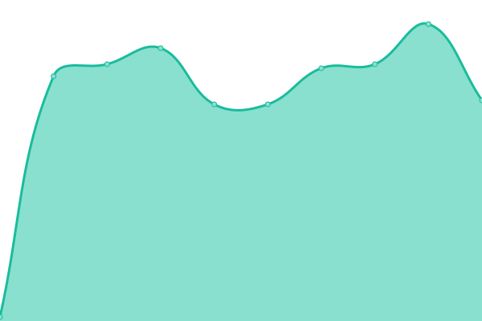
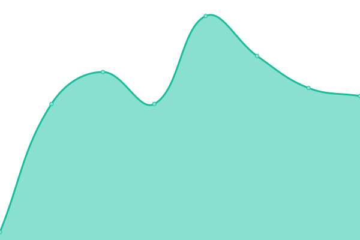
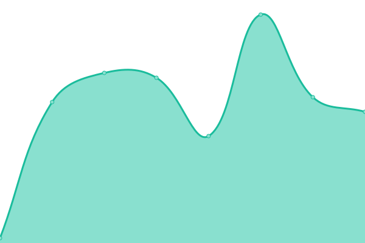
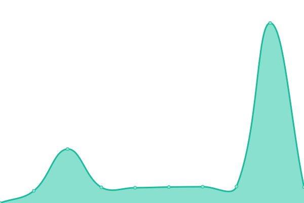
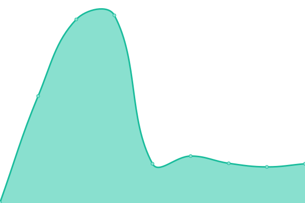

# [📈 Live Status](https://Dialog-Group-EU.github.io/uptime): <!--live status--> **🟩 All systems operational**

This repository contains the open-source uptime monitor and status page for [Dialog-Group-EU](https://Dialog-Group-EU.github.io/uptime), powered by [Upptime](https://github.com/upptime/upptime).

With [Upptime](https://upptime.js.org), you can get your own unlimited and free uptime monitor and status page, powered entirely by a GitHub repository. We use [Issues](https://github.com/Dialog-Group-EU/uptime/issues) as incident reports, [Actions](https://github.com/Dialog-Group-EU/uptime/actions) as uptime monitors, and [Pages](https://Dialog-Group-EU.github.io/uptime) for the status page.

<!--start: status pages-->
<!-- This summary is generated by Upptime (https://github.com/upptime/upptime) -->
<!-- Do not edit this manually, your changes will be overwritten -->
<!-- prettier-ignore -->
| URL | Status | History | Response Time | Uptime |
| --- | ------ | ------- | ------------- | ------ |
|  [Dialog Group Website](https://dialoggroup.eu) | 🟩 Up | [dialog-group-website.yml](https://github.com/Dialog-Group-EU/uptime/commits/HEAD/history/dialog-group-website.yml) | 

 69ms
     
 | 

<a href="https://status.dialoggroup.eu/history/dialog-group-website">100.00%</a>
    

|  [Digitale Collega Website](https://digitalecollega.eu) | 🟩 Up | [digitale-collega-website.yml](https://github.com/Dialog-Group-EU/uptime/commits/HEAD/history/digitale-collega-website.yml) | 

 21ms
     
 | 

<a href="https://status.dialoggroup.eu/history/digitale-collega-website">100.00%</a>
    

|  [Slimme Formulieren Website](https://slimmeformulieren.eu) | 🟩 Up | [slimme-formulieren-website.yml](https://github.com/Dialog-Group-EU/uptime/commits/HEAD/history/slimme-formulieren-website.yml) | 

 23ms
     
 | 

<a href="https://status.dialoggroup.eu/history/slimme-formulieren-website">100.00%</a>
    

|  [Insurance Demo 2Dialog](https://insurance.2dialog.eu) | 🟩 Up | [insurance-demo-2-dialog.yml](https://github.com/Dialog-Group-EU/uptime/commits/HEAD/history/insurance-demo-2-dialog.yml) | 

 129ms
     
 | 

<a href="https://status.dialoggroup.eu/history/insurance-demo-2-dialog">100.00%</a>
    

|  [Insurance Demo 1Dialog](https://insurance.1dialog.eu) | 🟩 Up | [insurance-demo-1-dialog.yml](https://github.com/Dialog-Group-EU/uptime/commits/HEAD/history/insurance-demo-1-dialog.yml) | 

 113ms
     
 | 

<a href="https://status.dialoggroup.eu/history/insurance-demo-1-dialog">100.00%</a>
    

|  EngageOne Communicate Authentication API | 🟩 Up | [engage-one-communicate-authentication-api.yml](https://github.com/Dialog-Group-EU/uptime/commits/HEAD/history/engage-one-communicate-authentication-api.yml) | 

 1496ms
     
 | 

<a href="https://status.dialoggroup.eu/history/engage-one-communicate-authentication-api">100.00%</a>
    

|  EngageOne Communicate EU-Central | 🟩 Up | [engage-one-communicate-eu-central.yml](https://github.com/Dialog-Group-EU/uptime/commits/HEAD/history/engage-one-communicate-eu-central.yml) | 

 2558ms
     
 | 

<a href="https://status.dialoggroup.eu/history/engage-one-communicate-eu-central">100.00%</a>
    

|  [EngageOne Video EU-West Prod](https://eu-west-1-mt-prod2.engageone.video/statuscheck/videoPlayer.php) | 🟩 Up | [engage-one-video-eu-west-prod.yml](https://github.com/Dialog-Group-EU/uptime/commits/HEAD/history/engage-one-video-eu-west-prod.yml) | 

 334ms
     
 | 

<a href="https://status.dialoggroup.eu/history/engage-one-video-eu-west-prod">100.00%</a>
    

|  [EngageOne Video EU-West Pre-Prod](https://eu-west-1-mt-preprod2.engageone.video/statuscheck/videoPlayer.php) | 🟩 Up | [engage-one-video-eu-west-pre-prod.yml](https://github.com/Dialog-Group-EU/uptime/commits/HEAD/history/engage-one-video-eu-west-pre-prod.yml) | 

 303ms
     
 | 

<a href="https://status.dialoggroup.eu/history/engage-one-video-eu-west-pre-prod">100.00%</a>
    

|  [Chatlayer](https://api.chatlayer.ai) | 🟩 Up | [chatlayer.yml](https://github.com/Dialog-Group-EU/uptime/commits/HEAD/history/chatlayer.yml) | 

 52ms
     
 | 

<a href="https://status.dialoggroup.eu/history/chatlayer">99.60%</a>
    

<!--end: status pages-->

[**Visit our status website →**](https://Dialog-Group-EU.github.io/uptime)

## 📄 License

- Powered by: [Upptime](https://github.com/upptime/upptime)
- Code: [MIT](./LICENSE) © [Dialog-Group-EU](https://Dialog-Group-EU.github.io/uptime)
- Data in the `./history` directory: [Open Database License](https://opendatacommons.org/licenses/odbl/1-0/)
